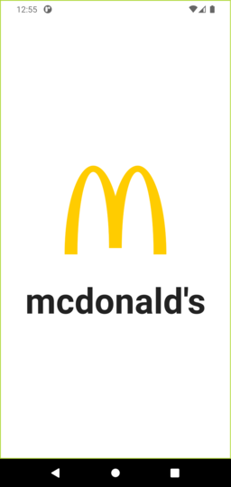
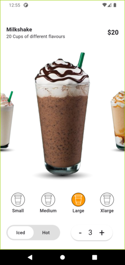

# 🍹 Drinks App

A Flutter application showcasing a drinks menu with animated transitions and splash screen.

## 🚀 Features

- Splash screen on launch
- Animated drinks menu
- Animated Drink details page
- Responsive UI

## 🛠️ Technologies Used

- [Flutter](https://flutter.dev/) (Dart)
- Platform support: Android, iOS, Windows, Linux, Web
- Local asset images for products and UI icons

## Screenshots

## Project Structure

- `lib/main.dart` - Entry point of the app ([lib/main.dart](lib/main.dart))
- `lib/pages/` - Contains main pages: [splash.dart](lib/pages/splash.dart), [home.dart](lib/pages/home.dart), [drink_details.dart](lib/pages/drink_details.dart)
- `assets/` - Images and other assets
